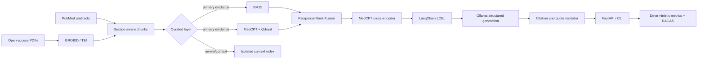

# Biomedical Evidence RAG

[](https://github.com/vinimundel/RAG-for-variant-analysis/actions/workflows/tests.yml)
[](https://www.python.org/)

A local-first retrieval-augmented generation system for evidence-grounded questions over
biomedical literature. It combines scientific document parsing, hybrid retrieval, structured
generation, citation verification, an HTTP API, and reproducible evaluation.

This is a standalone AI engineering portfolio project. BRAF oncology is an optional domain
profile and a two-paper public demo; retrieval, generation, serving, and evaluation accept
arbitrary biomedical collections without gene-specific branches.

> This system supports research literature review. It is not a clinical decision system and
> must not be used to diagnose, treat, or make patient-specific recommendations.

## What this project demonstrates

- **Document engineering:** GROBID-only PDF extraction, TEI caching, section-aware chunks, and
  SHA-256 provenance. Extraction failures stop the build; there is no alternate PDF parser.
- **Hybrid search:** exact biomedical tokens through BM25 plus semantic MedCPT retrieval in
  Qdrant, Reciprocal Rank Fusion, MedCPT cross-encoder reranking, and per-paper diversity limits.
- **Grounded generation:** LangChain LCEL orchestration, Ollama structured output, abstention,
  source text treated as untrusted input, citation ID whitelisting, and exact-quote validation.
- **Serving:** typed FastAPI endpoints, Pydantic contracts, bounded local concurrency, stable
  error statuses, CLI access, index fingerprints, and stage timings.
- **Evaluation:** deterministic source recall and status checks plus RAGAS `faithfulness` and
  `context_recall`, with evaluator provenance and persisted intermediate results.



## Quick start

Python 3.11 or newer, Docker, and Ollama are required for the complete local stack.

```bash
git clone https://github.com/vinimundel/RAG-for-variant-analysis.git
cd RAG-for-variant-analysis
python -m venv .venv
source .venv/bin/activate
python -m pip install -e '.[dev,eval]'
docker compose up -d grobid
ollama pull qwen2.5:1.5b
```

Download the three retrieval models once. Runtime loading is offline by design.

```bash
python - <<'PYTHON'
from huggingface_hub import snapshot_download

for model in (
    "ncbi/MedCPT-Query-Encoder",
    "ncbi/MedCPT-Article-Encoder",
    "ncbi/MedCPT-Cross-Encoder",
):
    snapshot_download(model)
PYTHON
```

## Run the BRAF demo

The manifest lists two peer-reviewed PLOS articles and publisher URLs. PDFs, TEI files, models,
indexes, and generated answers stay local and are excluded from Git.

```bash
python -m healthrag.pipeline.steps.prepare_demo
python -m healthrag.pipeline.steps.build_rag_index --collection BRAF --extract-only
docker compose stop grobid
python -m healthrag.pipeline.steps.build_rag_index --collection BRAF --index-only --overwrite

healthrag \
  --collection BRAF \
  --profile braf_oncology \
  --question "How was BRAF V600E associated with overall survival in metastatic colorectal cancer?"
```

CPU is the safe default, including under WSL. `MEDCPT_BATCH_SIZE` defaults to four and can be
reduced for limited memory. Retrieval resources are released before Ollama generation. CUDA is
opt-in through `MEDCPT_DEVICE=cuda`; use it only after verifying that WSL GPU passthrough is stable.
Ollama generation also defaults to CPU (`OLLAMA_NUM_GPU=0`) and the 1.5B model. A larger model or
GPU offload is an explicit quality/performance choice after a successful baseline run.
The runtime refuses to load heavy stages below conservative free-memory thresholds. Set
`HEALTHRAG_SKIP_MEMORY_GUARD=1` only when an external scheduler already enforces limits.

## Serve the API

Use one worker with embedded Qdrant. A server Qdrant deployment is the path to horizontal scaling.

```bash
uvicorn healthrag.api:app --host 127.0.0.1 --port 8000 --workers 1

curl -s http://127.0.0.1:8000/query \
  -H 'content-type: application/json' \
  -d '{
    "question": "What evidence links BRAF V600E to survival in metastatic colorectal cancer?",
    "collection": "BRAF",
    "profile": "braf_oncology",
    "k": 4
  }'
```

OpenAPI documentation is at `http://127.0.0.1:8000/docs`.

| Endpoint | Purpose |
|---|---|
| `GET /health` | Process liveness and version |
| `GET /profiles` | Available domain profiles |
| `POST /query` | Retrieval, structured generation, and verified citations |

Responses include sources, retrieval scores, model, prompt version, profile, index fingerprint,
generation attempts, and timings. Model outages are technical failures, never scientific abstentions.

## Bring your own collection

The collection identifier controls local paths and Qdrant names. Evidence and an optional profile
provide domain specialization.

```text
data/input/MY_COLLECTION/evidence/
├── pdfs/PMID12345678.pdf
├── records/pubmed_records.jsonl
├── my_collection_corpus_layers.csv
└── my_collection_literature_evidence.csv
```

The layer CSV contains `pmid` and `layer`. Allowed layers are `primary_evidence`,
`context_reference`, and `excluded`. Only primary evidence enters the answer index. Reviews remain
physically isolated, and exclusions remain visible for corpus audit.

```bash
python -m healthrag.pipeline.steps.build_rag_index --collection MY_COLLECTION --extract-only
python -m healthrag.pipeline.steps.build_rag_index --collection MY_COLLECTION --index-only --overwrite
healthrag --collection MY_COLLECTION --question "What did the primary studies report?"
```

Copy `src/rag/profiles/general.json` to add domain guidance without changing retrieval code. Pass
the file with `--profile-file path/to/profile.json`.

## Evaluation

No single metric captures RAG quality, so retrieval and generation are measured separately.

```bash
python -m healthrag.pipeline.steps.evaluate_qa \
  --dataset examples/braf/evaluation.jsonl \
  --output data/output/BRAF/evaluation.json

python -m healthrag.evaluation.ragas_eval \
  --input data/output/BRAF/evaluation.json \
  --output data/output/BRAF/ragas.json \
  --judge-model qwen2.5:1.5b
```

The first command records expected-source recall, answer/abstention status, retrieved passages,
validated answers, provenance, and timings. It checkpoints every query. The second uses the RAGAS
0.4 collections API through Ollama's OpenAI-compatible endpoint. It scores answered cases for
faithfulness and context recall, records failed metrics, and skips abstentions instead of turning
them into misleading zeros.

RAGAS is an LLM-as-a-judge measurement, not ground truth. Reports include judge and RAGAS versions;
semantic entailment still requires human review. See [evaluation design](Documentation/EVALUATION.md)
and [validation record](Documentation/VALIDATION.md). For WSL sizing, observed failure evidence,
and recovery guidance, see [local runtime safety](Documentation/LOCAL_RUNTIME_SAFETY.md).

## Engineering boundaries

- Source passages are untrusted input. The prompt rejects embedded commands, while response
  validation permits only known evidence IDs and exact quotes present in those passages.
- Exact quote validation proves traceability, not logical entailment.
- Retrieval scores are relevance signals, not biological confidence or clinical probability.
- Patient data, credentials, PDFs, weights, indexes, and generated outputs are not tracked.
- Production deployment would add authentication, rate limiting, distributed tracing, queues,
  server Qdrant, and monitored model endpoints.

## Repository map

```text
healthrag/rag/           ingestion, hybrid retrieval, profiles, generation contracts
healthrag/api.py         FastAPI service
healthrag/cli.py         command-line entry point
healthrag/evaluation/    optional RAGAS evaluation
healthrag/pipeline/      corpus preparation, indexing, deterministic evaluation
examples/braf/           public BRAF demo manifest and evaluation cases
tests/                   unit, contract, API, corpus-layer, and provenance tests
```

## Test

```bash
python -m pytest -q
```

CI runs without model downloads or external services.

## License

Code is MIT licensed. Article licenses remain with their publishers and authors.
